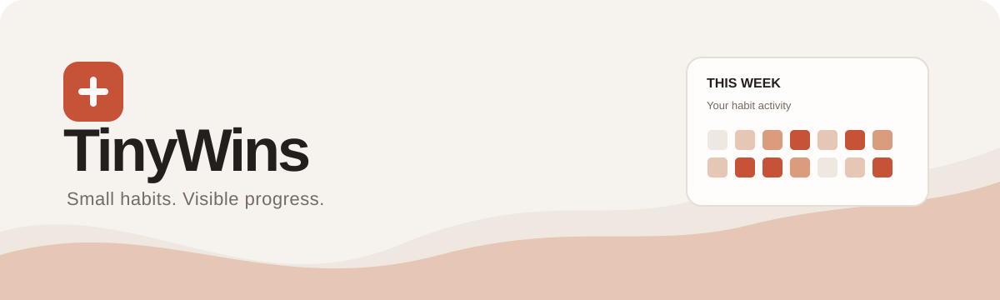
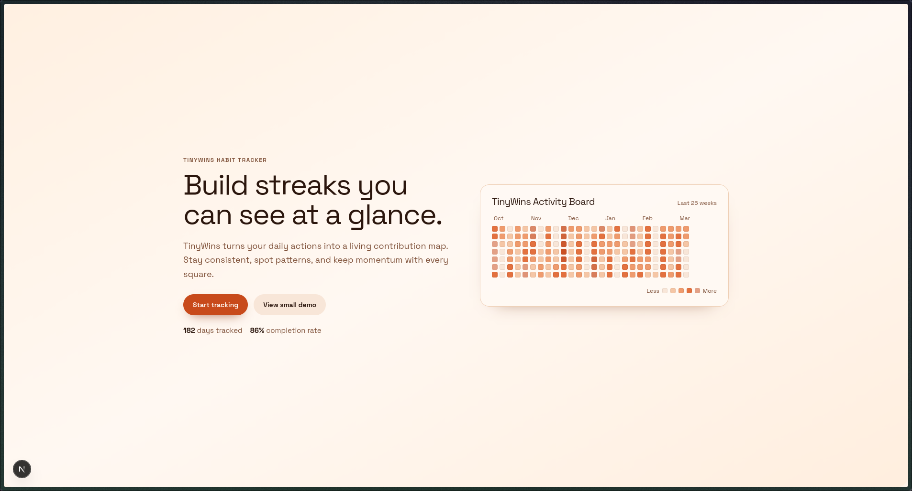
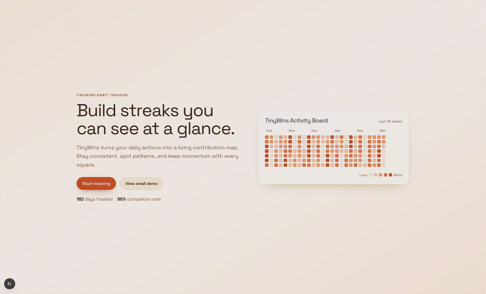
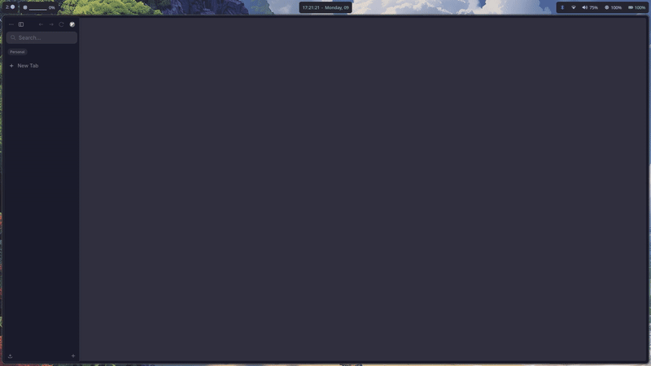

# TinyWins



TinyWins is a habit tracker with a Go API, PostgreSQL database, and Next.js frontend.

## Preview







## Requirements

- Go 1.26.1
- Bun
- PostgreSQL

## Run Locally

1. Configure the API. `backend/.env` must exist before starting it.

```bash
cp backend/.env.example backend/.env
```

Set `DATABASE_URL` in `backend/.env` to your local `squares` database. The default API address is `http://localhost:8800`.

2. Configure and start the frontend.

```bash
cp frontend/.env.example frontend/.env.local
cd frontend && bun install && bun dev
```

`NEXT_PUBLIC_BACKEND_URL` must point to the API and `NEXT_PUBLIC_COOKIE_NAME` must match the backend `COOKIE_NAME`.

3. Start the API in another terminal.

```bash
cd backend && go run .
```

Open `http://localhost:3000`.

## Seed Data

The seeder migrates the database and clears existing application data.

```bash
cd backend && go run ./cmd/seed
```

Sign in with `john@example.com` and `password123`.

## Verify

```bash
cd backend && go test -count=1 ./...
cd frontend && bun run build
```

Backend tests require an isolated PostgreSQL database configured by `DATABASE_TEST_URL`.
