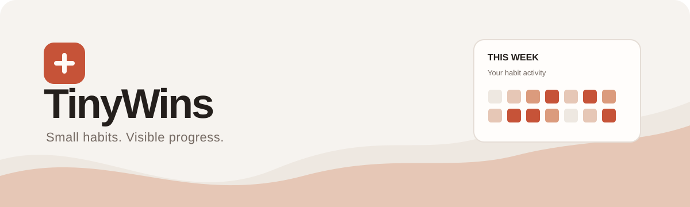
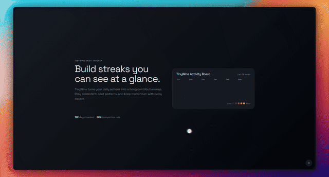

# TinyWins



TinyWins is a habit tracker with a Go API, PostgreSQL database, and Next.js frontend.

## Preview



## Requirements

- Go 1.26.1
- Bun
- PostgreSQL

## Run Locally

1. Configure the API. `backend/.env` must exist before starting it.

```bash
cp backend/.env.example backend/.env
```

Set `DATABASE_URL` in `backend/.env` to your local `squares` database. The default API address is `http://localhost:8800`.

2. Configure and start the frontend.

```bash
cp frontend/.env.example frontend/.env.local
cd frontend && bun install && bun dev
```

`NEXT_PUBLIC_BACKEND_URL` must point to the API and `NEXT_PUBLIC_COOKIE_NAME` must match the backend `COOKIE_NAME`.

3. Start the API in another terminal.

```bash
cd backend && go run .
```

Open `http://localhost:3000`.

## Deploy With Docker

The root `docker-compose.yaml` builds the API and frontend images and runs them
behind [Caddy](https://caddyserver.com/) alongside PostgreSQL. Caddy serves the
frontend and reverse-proxies `/api/*` to the Go API, so the browser only ever
talks to one origin and Caddy obtains a TLS certificate automatically.

1. Point an `A`/`AAAA` record for your domain at the server and open ports `80`
   and `443`.

2. Create a root `.env` from the example.

```bash
cp .env.example .env
```

The `.env` file is not committed, so Compose falls back to `DOMAIN=tinywins.frasier.dev`
and a default database password if it is missing. Create it to override the domain,
set `ACME_EMAIL` for certificate expiry notices, and change `POSTGRES_PASSWORD`.
Secure cookies require HTTPS, which Caddy provides, so keep `COOKIE_SECURE=true`.

3. Build and start the stack.

```bash
docker compose up -d --build
```

The site is served at `https://$DOMAIN` and the API at `https://$DOMAIN/api`.
Only Caddy is exposed publicly; the API (`8800`), frontend (`3000`) and database
(`5499`/`5501`) are bound to `127.0.0.1`. Certificates are stored in the
`caddy_data` volume, so back it up and keep it across deployments.

The browser API URL is fixed to the same-origin `/api` and is baked into the
frontend at build time. After pulling changes, rebuild the web image so the bundle
is regenerated:

```bash
docker compose build web && docker compose up -d
```

### Checking Ports 80 And 443

Test from a machine **outside** the VPS — a server can often reach its own public
IP even when the provider blocks inbound traffic.

```bash
nc -vz tinywins.frasier.dev 80
nc -vz tinywins.frasier.dev 443
curl -I http://tinywins.frasier.dev
```

On the VPS, confirm Caddy is listening and inspect host firewalls:

```bash
ss -tlnp | grep -E ':(80|443)\b'
sudo ufw status verbose          # ufw
sudo nft list ruleset            # nftables
sudo firewall-cmd --list-all     # firewalld
```

Also check the provider console for a security group, firewall, or network ACL;
some hosts (e.g. Oracle Cloud) block inbound traffic by default. Docker publishes
ports through its own iptables rules, so `ufw` may not reflect Docker traffic. If
`80` is blocked but `443` is open, Caddy can still issue certificates via the
TLS-ALPN challenge on `443`.

## Seed Data

The seeder migrates the database and clears existing application data.

```bash
cd backend && go run ./cmd/seed
```

Sign in with `john@example.com` and `password123`.

## Verify

```bash
cd backend && go test -count=1 ./...
cd frontend && bun run build
```

Backend tests require an isolated PostgreSQL database configured by `DATABASE_TEST_URL`.
